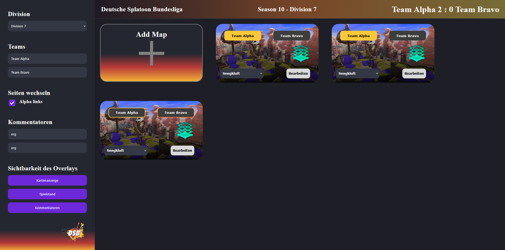
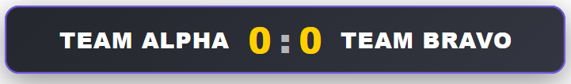
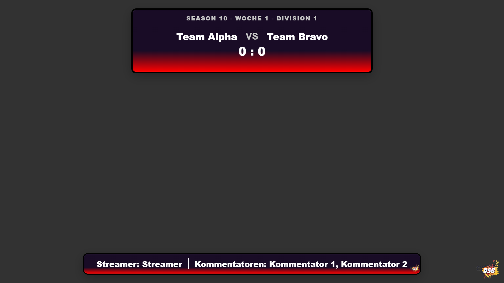
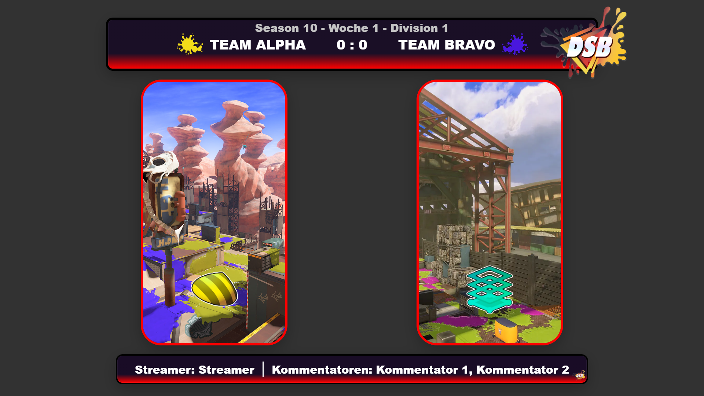

# DSB Streaming Tool

> Real-time overlay suite for Splatoon live streams - originally built for the **Deutsche Splatoon Bundesliga (DSB)**.

Overlays run as Browser Sources in OBS and are controlled through a dedicated Control Panel. All data updates in real-time via [SignalR](https://dotnet.microsoft.com/en-us/apps/aspnet/signalr).


---

## Table of Contents

- [Quickstart](#quickstart)
- [Tech Stack & Overlay Routes](#technical-documentation)
- [Screenshots](#screenshots)
- [Contributing](#contributing)
- [Credits](#credits)

---

## Quickstart

There are start scripts for both Windows and Linux/macOS. They check for required dependencies (Node.js, .NET 9 SDK), start the frontend and backend, and open the Control Panel in your browser automatically.

| Platform | Script |
|---|---|
| Windows | `start.bat` |
| Linux / macOS | `start.sh` |

> **Note:** The scripts will prompt you to install missing dependencies via WinGet (Windows) or your system package manager (Linux/macOS).

### Manual Start

<details>
<summary>Start frontend and backend manually</summary>

**Backend**

1. Open `Backend/DSB.StreamBackend/DSB.StreamBackend.csproj` in Visual Studio.
2. Start the project - the server runs on `https://localhost:{port}` (exact URL shown in the output window).
3. Swagger UI is available at `/swagger`.

**Frontend**

```bash
cd Frontend/control-panel
npm install
npm start
```

Angular serves on `http://localhost:4200`. The Control Panel is at the root URL; overlays are accessible at their respective routes (see [Overlay Routes](#overlay-routes-http)).

</details>

> **Note:** The backend must be running for overlays to receive live updates via SignalR.

---

## Technical Documentation

For in-depth technical documentation, see the [`docs/`](docs/) folder.

### Tech Stack

| Layer | Technology |
|---|---|
| **Frontend** | Angular (Control Panel + Overlays) |
| **Backend** | ASP.NET Core 9, SignalR, SQLite |

### Overlay Routes (HTTP)

| Route | Description |
|---|---|
| `/overlay/score-box` | Score display for both teams |
| `/overlay/map-screen` | Map overview |
| `/overlay/commentator-box` | Commentator names |
| `/overlay/info-box` | General info box |

---

## How to Use

> **TBA** - user guide coming soon.

---

## Screenshots

**Control Panel**


**Score-Box Overlay**


**Info-Box Overlay**


**Map Overview Overlay**


---

## Contributing

Contributions are welcome - whether you are a first-time coder or an experienced developer.

> **Please do not use AI-generated code or assets.** AI-generated images and other assets will be rejected.

### Pull Request Process

Every pull request is reviewed by the maintainers defined in the [CODEOWNERS](.github/CODEOWNERS) file.

| Contributor | Role |
|---|---|
| [@Hazeolation](https://github.com/Hazeolation) | Original Maintainer, Head of Decisions |
| [@iLollek](https://github.com/iLollek) | Original Contributor - ReleaseNoteGenerator, Frontend & Backend |
| [@RubberDuckCollector](https://github.com/RubberDuckCollector) | Original Contributor - Frontend & Backend |
| [@BucketRaphi](https://github.com/BucketRaphi) | Original Contributor - Frontend |

### Repository Language Rules

| Scope | Language |
|---|---|
| Code & Documentation | English |
| Comments | English |
| UI Texts | German |

---

## How to Support

> Coming soon.

---

## Credits

| Name | Description |
|---|---|
| [@CrispyNugget99](https://www.artstation.com/michelle993) | Created Designs for the UI |
